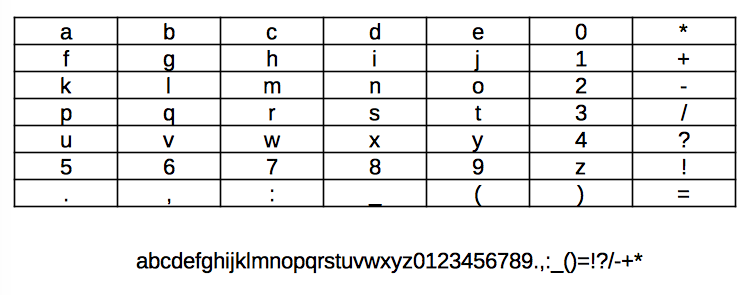
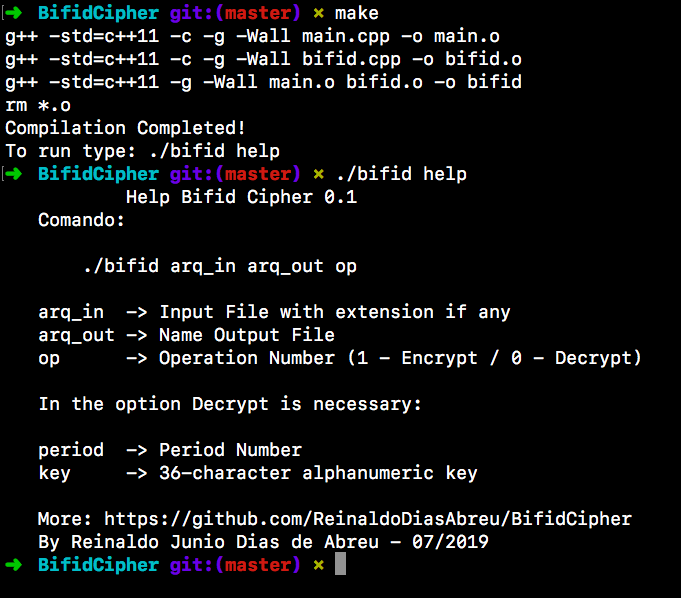
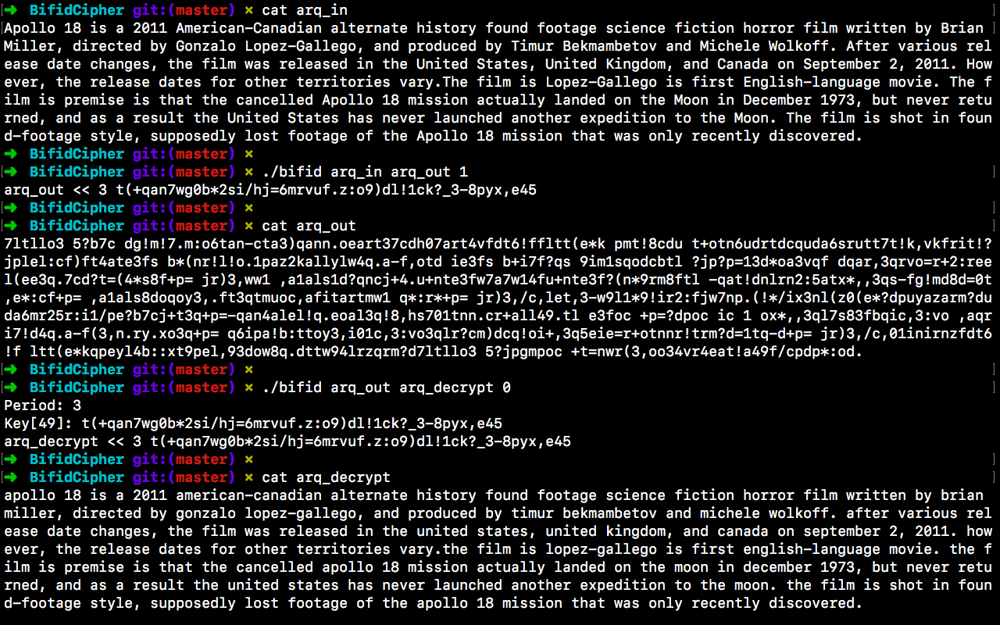

# BifidCipher
The bifid cipher alphanumeric

Program to encrypt text files using bifid cipher, the system accepts characters and numbers.

The algorithm randomly draws a 49-character alphanumeric key, and also generates the period used during encryption. After completing the encryption the following output is obtained, which corresponds to the output file name, period and key. To decrypt it is necessary to enter in addition to the input and output file the period and the alphanumeric key. 

At the moment the algorithm does not consider accents and line breaks.

The characters allowed are those in the table below, but you can replace them with others in the code.

The underscore character represents the space character, where in the code the substitution is made.

See below an example of execution:

The program will always generate an output file and will not overwrite if the passed name already exists.

The security of this method is given by the amount of possible keys that can be generated, so so far we have: 3,04140932e63 possibilities. However decryption is possible by statistical methods.

